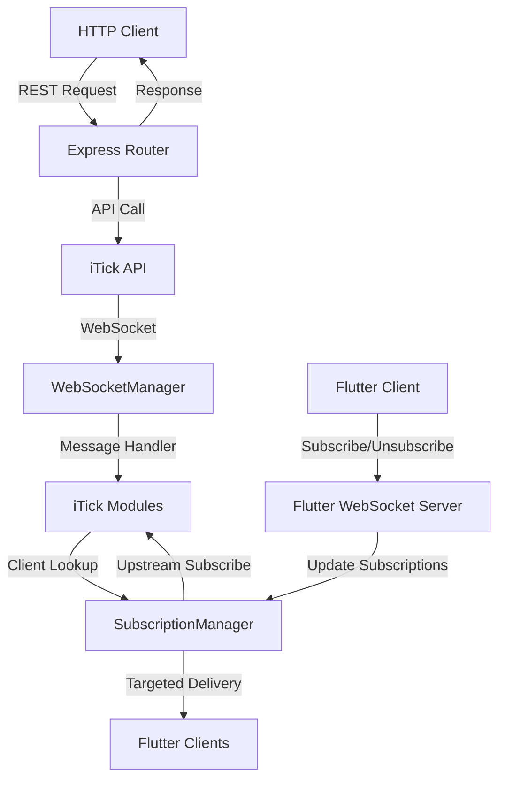

# RC Server - Real-Time Financial Data Gateway

A high-performance Node.js server that provides real-time financial data streaming from iTick API to Flutter clients via WebSocket, with additional HTTP REST endpoints for historical data.

## 🚀 Features

### Core Capabilities
- **Real-time Data Streaming**: Live forex, crypto, and indices data via WebSocket
- **Multi-Asset Support**: Forex, Cryptocurrency, and Market Indices
- **Client Isolation**: Independent subscription management per client
- **Automatic Reconnection**: Robust WebSocket connection handling with ping/pong
- **HTTP REST API**: Historical candlestick and quote data endpoints
- **CORS Support**: Cross-origin request handling for web applications

### Technical Features
- **ES6 Modules**: Modern JavaScript with import/export syntax
- **WebSocket Management**: Efficient connection pooling and message routing
- **Subscription Management**: Smart client-symbol mapping with cleanup
- **Logging System**: Structured logging with context and timestamps
- **Error Handling**: Comprehensive error handling and recovery
- **Environment Configuration**: Secure environment variable management

## 🏗️ Architecture Overview

```
┌─────────────────┐    ┌──────────────────┐    ┌─────────────────┐
│   Flutter       │    │   RC Server      │    │   iTick API     │
│   Clients       │◄──►│   (Node.js)      │◄──►│   (WebSocket)   │
│                 │    │                  │    │                 │
└─────────────────┘    └──────────────────┘    └─────────────────┘
        │                       │                       │
        │                       │                       │
        ▼                       ▼                       ▼
┌─────────────────┐    ┌──────────────────┐    ┌─────────────────┐
│   WebSocket     │    │   HTTP REST      │    │   Real-time     │
│   Streaming     │    │   Endpoints      │    │   Data Feed     │
└─────────────────┘    └──────────────────┘    └─────────────────┘
```

## 📁 Project Structure

```
rc_server_temp1/
├── config/                 # Configuration files
│   ├── envConfig.js       # Environment variables
│   └── websocket.js       # WebSocket configuration
├── core/                   # Core business logic
├── http/                   # HTTP REST endpoints
│   ├── candlestick.js     # Historical candlestick data
│   └── quote.js           # Real-time quote data
├── services/               # Business services
├── sockets/                # WebSocket implementations
│   ├── flutterClient.js   # Flutter client WebSocket server
│   ├── iTickForex.js      # Forex data connection
│   ├── iTickCrypto.js     # Crypto data connection
│   └── iTickIndices.js    # Indices data connection
├── utils/                  # Utility functions
│   ├── logger.js          # Structured logging
│   ├── ping.js            # WebSocket ping/pong
│   └── subscriptionManager.js # Client subscription management
├── websocket/              # WebSocket management
│   └── WebSocketManager.js # Base WebSocket class
├── server.js               # Main server entry point
├── package.json            # Dependencies and scripts
└── README.md               # This file
```

## 🔧 Installation & Setup

### Prerequisites
- Node.js 18+ 
- npm or yarn
- iTick API credentials

### 1. Clone Repository
```bash
git clone <your-repo-url>
cd rc_server_temp1
```

### 2. Install Dependencies
```bash
npm install
```

### 3. Environment Configuration
Create a `.env` file in the root directory:

```bash
# iTick API Configuration
ITICK_WS_AUTH_TOKEN=your_authentication_token_here
ITICK_FOREX_WS_URL=wss://api.itick.org/fws
ITICK_CRYPTO_WS_URL=wss://api.itick.org/cws
ITICK_INDICES_WS_URL=wss://api.itick.org/iws
```

#### Complete .env File Example
```bash
# ========================================
# RC Server Environment Configuration
# ========================================

# iTick API Authentication
# Replace 'your_actual_token_here' with your real iTick API token
ITICK_WS_AUTH_TOKEN=your_actual_token_here

# iTick WebSocket URLs
ITICK_FOREX_WS_URL=wss://api.itick.org/fws
ITICK_CRYPTO_WS_URL=wss://api.itick.org/cws
ITICK_INDICES_WS_URL=wss://api.itick.org/iws

# ========================================
# Optional Configuration
# ========================================

# Server Configuration (defaults shown)
# PORT=3000
# NODE_ENV=development

# Logging Configuration
# LOG_LEVEL=info
# LOG_FILE=logs/server.log

# WebSocket Configuration
# WS_PING_INTERVAL=20000
# WS_RECONNECT_DELAY=5000

# CORS Configuration
# CORS_ORIGIN=*
# CORS_METHODS=GET,POST,PUT,DELETE,OPTIONS
# CORS_HEADERS=Origin,X-Requested-With,Content-Type,Accept,Authorization
```

#### Environment Variables Reference

| Variable | Required | Default | Description |
|----------|----------|---------|-------------|
| `ITICK_WS_AUTH_TOKEN` | ✅ Yes | - | Your iTick API authentication token |
| `ITICK_FOREX_WS_URL` | ✅ Yes | `wss://api.itick.org/fws` | Forex WebSocket endpoint |
| `ITICK_CRYPTO_WS_URL` | ✅ Yes | `wss://api.itick.org/cws` | Crypto WebSocket endpoint |
| `ITICK_INDICES_WS_URL` | ✅ Yes | `wss://api.itick.org/iws` | Indices WebSocket endpoint |
| `PORT` | ❌ No | `3000` | Server port number |
| `NODE_ENV` | ❌ No | `development` | Environment mode |
| `LOG_LEVEL` | ❌ No | `info` | Logging level (debug, info, warn, error) |
| `WS_PING_INTERVAL` | ❌ No | `20000` | WebSocket ping interval in milliseconds |
| `WS_RECONNECT_DELAY` | ❌ No | `5000` | Reconnection delay in milliseconds |

#### Security Notes
- **Never commit your .env file to git** (it's already in .gitignore)
- **Keep your API token secure** and rotate it regularly
- **Use different tokens for development and production**
- **Set proper file permissions**: `chmod 600 .env`

### 4. Start Server
```bash
# Development mode with auto-reload
npm run dev

# Production mode
npm start
```

## 🌐 API Endpoints

### WebSocket Connection
- **URL**: `ws://localhost:3000`
- **Protocol**: WebSocket
- **Authentication**: None (public endpoint)

### HTTP REST Endpoints

#### 1. Candlestick Data
```
GET /http/candlestick?type={asset_type}&code={symbol}&kType={interval}&et={timestamp}&limit={count}
```

**Parameters:**
- `type`: Asset type (`forex`, `crypto`, `indices`)
- `code`: Symbol code (e.g., `EURUSD`, `BTCUSD`)
- `kType`: K-line interval
- `et`: End timestamp
- `limit`: Number of candles to return

**Example:**
```bash
curl "http://localhost:3000/http/candlestick?type=forex&code=EURUSD&kType=1m&et=1640995200000&limit=100"
```

#### 2. Quote Data
```
GET /http/quote?type={asset_type}&symbol={symbol}
```

**Parameters:**
- `type`: Asset type (`forex`, `crypto`, `indices`)
- `symbol`: Symbol code

**Example:**
```bash
curl "http://localhost:3000/http/quote?type=forex&symbol=EURUSD"
```

## 📡 WebSocket Protocol

### Connection
Flutter clients connect to `ws://localhost:3000` and send JSON messages for subscription management.

### Message Format

#### Subscribe to Symbols
```json
{
  "data": "forex",
  "type": "subscribe",
  "symbol": "EURUSD,GBPUSD"
}
```

#### Unsubscribe from Symbols
```json
{
  "data": "crypto",
  "type": "unsubscribe",
  "symbol": "BTCUSD"
}
```

### Message Fields
- **`data`**: Asset type (`forex`, `crypto`, `indices`)
- **`type`**: Action (`subscribe` or `unsubscribe`)
- **`symbol`**: Single symbol or comma-separated list

### Supported Asset Types
1. **Forex**: Currency pairs (e.g., EURUSD, GBPUSD)
2. **Crypto**: Cryptocurrency pairs (e.g., BTCUSD, ETHUSD)
3. **Indices**: Market indices (e.g., SPX500, NASDAQ)

## 🔄 Data Flow Architecture



## 🧠 Subscription Management

### Client-Symbol Mapping
The system maintains three independent maps:
- `forexSymbolClientMap`: Forex symbol → Set of clients
- `cryptoSymbolClientMap`: Crypto symbol → Set of clients  
- `indicesSymbolClientMap`: Indices symbol → Set of clients

### Subscription Logic
1. **First Client**: When first client subscribes to a symbol, upstream subscription is initiated
2. **Additional Clients**: Subsequent clients join the symbol's client set without duplicate upstream calls
3. **Last Client**: When last client unsubscribes, upstream unsubscription occurs
4. **Cleanup**: Disconnected clients are automatically removed from all subscriptions

### Memory Management
- Automatic cleanup of empty symbol entries
- Client connection state validation before message delivery
- Efficient Set-based client collections

## 🔌 WebSocket Management

### Connection Handling
- **Automatic Reconnection**: 5-second retry on connection loss
- **Ping/Pong**: 20-second heartbeat to maintain connection
- **Error Recovery**: Graceful error handling with logging

### Message Processing
- **JSON Parsing**: Robust message parsing with error handling
- **Handler Registration**: Multiple message handlers per connection
- **Filtering**: Automatic ping/pong message filtering

## 📊 Logging & Monitoring

### Log Levels
- **INFO**: Connection events, subscriptions, successful operations
- **WARN**: Invalid requests, connection issues
- **ERROR**: Connection failures, message parsing errors
- **DEBUG**: Development-only detailed information

### Log Format
```
[2024-01-15T10:30:45.123Z] [INFO] [WebSocket:forex] Connected to forex WebSocket
[2024-01-15T10:30:45.124Z] [INFO] [FlutterClient] Client connected
[2024-01-15T10:30:45.125Z] [INFO] [SubscriptionManager] Client added to forex symbol: EURUSD
```

## 🚀 Performance Features

### Efficient Data Routing
- **Targeted Delivery**: Messages sent only to subscribed clients
- **Set Operations**: Fast client lookup and management
- **Memory Optimization**: Automatic cleanup of disconnected clients

### Connection Management
- **Connection Pooling**: Single upstream connection per asset type
- **Message Broadcasting**: Efficient message distribution to multiple clients
- **Automatic Scaling**: Handles multiple clients per symbol efficiently

## 🔒 Security Features

### Environment Variable Protection
- **No Hardcoded Secrets**: All sensitive data via environment variables
- **Git Ignore**: `.env` file excluded from version control
- **Runtime Validation**: Required environment variables checked at startup

### CORS Configuration
- **Cross-Origin Support**: Configurable CORS headers for web applications
- **Method Restrictions**: Controlled HTTP method access
- **Header Management**: Secure header handling

## 🐛 Troubleshooting

### Common Issues

#### 1. Connection Failures
```bash
# Check environment variables
echo $ITICK_WS_AUTH_TOKEN

# Verify network connectivity
ping api.itick.org

# Check server logs
tail -f logs/server.log
```

#### 2. Subscription Issues
```bash
# Check client connections
netstat -an | grep :3000

# Verify subscription manager state
# Add debug logging to subscriptionManager.js
```

#### 3. Environment Configuration
```bash
# Validate .env file
cat .env

# Check file permissions
ls -la .env
```

### Debug Mode
Enable debug logging by setting environment variable:
```bash
export NODE_ENV=development
npm run dev
```

## 📈 Monitoring & Health Checks

### Health Endpoint
```
GET /
Response: "Flutter HTTP+WebSocket Gateway Running"
```

### Connection Status
Monitor WebSocket connections and subscription counts in server logs.

### Performance Metrics
- Active client connections
- Symbols with active subscriptions
- Message delivery rates
- Connection stability

## 🔄 Deployment

### Production Setup
1. **Environment Variables**: Set production environment variables
2. **Process Management**: Use PM2 or systemd for process management
3. **Logging**: Configure production logging and monitoring
4. **Security**: Implement proper firewall and access controls

### Docker Deployment
```dockerfile
FROM node:18-alpine
WORKDIR /app
COPY package*.json ./
RUN npm ci --only=production
COPY . .
EXPOSE 3000
CMD ["npm", "start"]
```

### AWS EC2 Deployment
```bash
# Install Node.js
curl -fsSL https://deb.nodesource.com/setup_18.x | sudo -E bash -
sudo apt-get install -y nodejs

# Clone and setup
git clone <your-repo>
cd rc_server_temp1
npm install

# Create .env file
nano .env
chmod 600 .env

# Start with PM2
npm install -g pm2
pm2 start server.js --name "rc-server"
pm2 startup
pm2 save
```

## 🤝 Contributing

1. Fork the repository
2. Create a feature branch
3. Make your changes
4. Add tests if applicable
5. Submit a pull request

## 📄 License

This project is licensed under the ISC License.

## 📞 Support

For issues and questions:
- Create an issue in the repository
- Check the troubleshooting section
- Review server logs for error details

## 🔮 Future Enhancements

- **Rate Limiting**: Client request rate limiting
- **Authentication**: WebSocket client authentication
- **Metrics**: Prometheus metrics integration
- **Caching**: Redis-based data caching
- **Load Balancing**: Multiple server instances
- **SSL/TLS**: Secure WebSocket connections
- **API Versioning**: Versioned API endpoints
- **Webhook Support**: Real-time event notifications 
