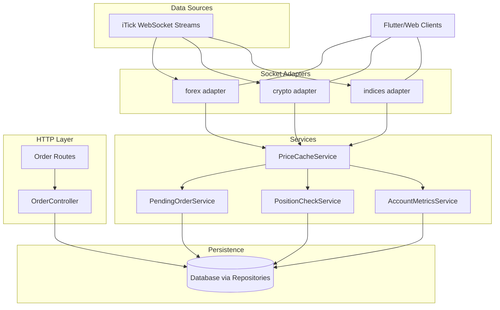

# 🚀 Real-Time Financial Data Gateway Server

A robust Node.js server that acts as a real-time financial data gateway for Flutter clients, integrating with the iTick API and Supabase database. Features include WebSocket communication, subscription management, price tracking, and email services.

## 📋 Table of Contents

- [🏗️ Architecture Overview](#️-architecture-overview)
- [🔧 Features](#-features)
- [📁 Project Structure](#-project-structure)
- [🚀 Installation & Setup](#-installation--setup)
- [⚙️ Configuration](#️-configuration)
- [🌐 API Endpoints](#-api-endpoints)
- [📡 WebSocket Communication](#-websocket-communication)
- [💾 Database Integration](#-database-integration)
- [📧 Email Service](#-email-service)
- [🔐 Security & Authentication](#-security--authentication)
- [🧪 Testing](#-testing)
- [🚀 Deployment](#-deployment)
- [📊 Monitoring & Logging](#-monitoring--logging)
- [🛠️ Troubleshooting](#️-troubleshooting)

## 🏗️ Architecture Overview

### System Architecture Diagram

```
┌─────────────────┐    ┌─────────────────┐    ┌─────────────────┐
│   Flutter       │    │   Node.js       │    │   iTick API     │
│   Clients       │◄──►│   Server        │◄──►│   (Forex/Crypto)│
│                 │    │                 │    │                 │
│ • Mobile App    │    │ • WebSocket     │    │ • Real-time     │
│ • Web App       │    │   Manager       │    │   Data Stream   │
│ • Desktop App   │    │ • Subscription  │    │ • Market Data   │
└─────────────────┘    │   Manager       │    │ • Price Updates │
                       │ • HTTP API      │    └─────────────────┘
                       │ • Email Service │
                       └─────────────────┘
                                │
                                ▼
                       ┌─────────────────┐
                       │   Supabase      │
                       │   Database      │
                       │                 │
                       │ • Symbols Table │
                       │ • Price History │
                       │ • User Data     │
                       └─────────────────┘
```

### Data Flow Architecture

```
┌─────────────┐    ┌─────────────┐    ┌─────────────┐    ┌─────────────┐
│ Flutter     │───►│ Server     │───►│ iTick API  │───►│ Market     │
│ Client      │    │ WebSocket  │    │ WebSocket  │    │ Data      │
│ Subscribe   │    │ Handler    │    │ Connection │    │ Stream    │
└─────────────┘    └─────────────┘    └─────────────┘    └─────────────┘
         │                   │                   │                   │
         │                   ▼                   ▼                   │
         │            ┌─────────────┐    ┌─────────────┐            │
         │            │ Subscription│    │ Data       │            │
         │            │ Manager     │    │ Processing │            │
         │            └─────────────┘    └─────────────┘            │
         │                   │                   │                   │
         │                   ▼                   ▼                   │
         │            ┌─────────────┐    ┌─────────────┐            │
         │            │ Database    │    │ Price      │            │
         │            │ Service     │    │ Update     │            │
         │            └─────────────┘    │ Service    │            │
         │                   │           └─────────────┘            │
         │                   ▼                   │                   │
         │            ┌─────────────┐            │                   │
         │            │ Supabase    │            │                   │
         │            │ Database    │            │                   │
         │            └─────────────┘            │                   │
         │                   │                   │                   │
         └───────────────────┼───────────────────┼───────────────────┘
                             ▼                   ▼
                    ┌─────────────┐    ┌─────────────┐
                    │ HTTP API    │    │ Email      │
                    │ Endpoints   │    │ Service    │
                    └─────────────┘    └─────────────┘
```

## 🔧 Features

### 🎯 Core Features

| Feature                      | Description                                 | Status    |
| ---------------------------- | ------------------------------------------- | --------- |
| **Real-time Data Streaming** | WebSocket-based live financial data         | ✅ Active |
| **Multi-Asset Support**      | Forex, Crypto, Indices data streams         | ✅ Active |
| **Subscription Management**  | Per-client, per-symbol subscriptions        | ✅ Active |
| **Database Integration**     | Supabase PostgreSQL integration             | ✅ Active |
| **Price Tracking**           | Automatic price updates for tracked symbols | ✅ Active |
| **Email Service**            | Trading credentials delivery                | ✅ Active |
| **HTTP API**                 | RESTful endpoints for data access           | ✅ Active |

### 📊 Feature Implementation Details

#### 1. Real-time Data Streaming

- **Protocol:** WebSocket (ws://)
- **Data Format:** JSON with real-time price updates
- **Frequency:** Continuous streaming from iTick API
- **Latency:** Sub-second updates

#### 2. Subscription Management

- **Architecture:** Map<symbol, Set<client>> structure
- **Efficiency:** First/Last client logic for API optimization
- **Scalability:** Independent client subscriptions
- **Isolation:** Clients receive only subscribed data

#### 3. Database Integration

- **Database:** Supabase (PostgreSQL)
- **Table:** `symbols` with composite primary key
- **Operations:** CRUD for symbol management
- **Triggers:** Automated price updates

## 📁 Project Structure

```
rc_server_temp1/
├── 📁 assets/                    # Static assets
│   ├── raz_caps_logo.png        # Company logo
│   └── Frame 1000001664.svg     # Alternative logo
├── 📁 config/                    # Configuration files
│   ├── envConfig.js             # Environment variables
│   ├── supabase.js              # Database client
│   └── symbols.js               # Hardcoded symbol list
├── 📁 core/                      # Core business logic
├── 📁 http/                      # HTTP API endpoints
│   ├── candlestick.js           # K-line data API
│   ├── quote.js                 # Real-time quotes API
│   ├── symbols.js               # Symbol management API
│   └── tradingCredentials.js    # Email service API
├── 📁 services/                  # Business services
│   ├── databaseService.js       # Database operations
│   ├── emailService.js          # Email functionality
│   ├── [removed] priceUpdateService.js    # (Removed)
│   └── symbolManagementService.js # Symbol CRUD
├── 📁 sockets/                   # WebSocket handlers
│   ├── flutterClient.js         # Flutter client handler
│   ├── iTickCrypto.js           # Crypto data handler
│   ├── iTickForex.js            # Forex data handler
│   └── iTickIndices.js          # Indices data handler
├── 📁 utils/                     # Utility functions
│   ├── logger.js                # Logging utility
│   ├── ping.js                  # Health checks
│   └── subscriptionManager.js    # Subscription logic
├── 📁 websocket/                 # WebSocket management
│   └── WebSocketManager.js      # Generic WebSocket class
├── 📁 scripts/                   # Utility scripts
│   ├── initAllSymbols.js        # Database initialization
│   ├── manageSymbols.js         # Symbol management CLI
│   ├── testEmailService.js      # Email testing
│   └── testSetup.js             # System testing
├── server.js                     # Main server file
├── package.json                  # Dependencies
└── README.md                     # This file
```

## 🚀 Installation & Setup

### Prerequisites

- **Node.js:** v16+ (Recommended: v18+)
- **npm:** v8+ or **yarn:** v1.22+
- **Supabase Account:** For database
- **Gmail Account:** For email service (with App Password)

### Installation Steps

```bash
# 1. Clone the repository
git clone <your-repo-url>
cd rc_server_temp1

# 2. Install dependencies
npm install

# 3. Create environment file
cp env-template.txt .env

# 4. Configure environment variables
# Edit .env file with your credentials

# 5. Start the server
npm start
```

### Environment Variables

```bash
# iTick API Configuration
ITICK_WS_AUTH_TOKEN=your_itick_auth_token_here
ITICK_FOREX_WS_URL=wss://api.itick.org/forex/ws
ITICK_CRYPTO_WS_URL=wss://api.itick.org/crypto/ws
ITICK_INDICES_WS_URL=wss://api.itick.org/indices/ws

# Supabase Database Configuration
SUPABASE_URL=your_supabase_url_here
SUPABASE_ANON_KEY=your_supabase_anon_key_here

# Email Service Configuration
EMAIL_USER=your_gmail_address@gmail.com
EMAIL_APP_PASSWORD=your_gmail_app_password_here

# Logo Path Configuration (relative to project root)
LOGO_PATH=./assets/raz_caps_logo.png
```

## ⚙️ Configuration

### Database Schema

```sql
-- Symbols table structure
CREATE TABLE symbols (
    symbol_name VARCHAR(50) NOT NULL,
    symbol_type VARCHAR(20) NOT NULL,
    price DECIMAL(15,6),
    added_at TIMESTAMP DEFAULT CURRENT_TIMESTAMP,
    last_updated TIMESTAMP DEFAULT CURRENT_TIMESTAMP,
    PRIMARY KEY (symbol_name, symbol_type)
);

-- Index for performance
CREATE INDEX idx_symbols_type ON symbols(symbol_type);
CREATE INDEX idx_symbols_updated ON symbols(last_updated);
```

### Symbol Configuration

The previous hardcoded list and symbols table have been removed.

```javascript
export const TRACKED_SYMBOLS = {
  forex: ["EURUSD", "GBPUSD", "USDJPY", "AUDUSD", "USDCAD"],
  crypto: ["BTCUSD", "ETHUSD", "ADAUSD", "DOTUSD", "LINKUSD"],
  indices: ["SPX500", "NAS100", "US30", "GER30", "UK100"],
};
```

## 🌐 API Endpoints

### HTTP API Endpoints

#### 1. Candlestick Data

```http
GET /http/candlestick?type=forex&code=EURUSD&kType=1&et=1754906064962&limit=10
```

**Parameters:**

- `type`: Asset type (forex, crypto, indices)
- `code`: Symbol code
- `kType`: K-line type
- `et`: End timestamp
- `limit`: Number of candles

**Response:**

```json
{
  "code": 0,
  "msg": null,
  "data": [
    {
      "tu": 2896.706134,
      "c": 1.16426,
      "t": 1754905500000,
      "v": 2488,
      "h": 1.16434,
      "l": 1.16421,
      "o": 1.16432
    }
  ]
}
```

#### 2. Real-time Quotes

```http
GET /http/quote?type=forex&symbol=EURUSD
```

**Parameters:**

- `type`: Asset type (forex, crypto, indices)
- `symbol`: Symbol name

**Response:**

```json
{
  "code": 0,
  "msg": null,
  "data": {
    "s": "EURUSD",
    "ld": 1.17282,
    "o": 1.17152,
    "h": 1.17304,
    "l": 1.1713,
    "t": 1755080082750,
    "v": 116360.17152,
    "tu": 136403.131034,
    "ts": 0
  }
}
```

#### 3. Symbol Management

```http
# Get all tracked symbols
GET /http/tracked

# Get symbols by type
GET /http/tracked/forex

# Add new symbol
POST /http/tracked
{
  "symbol": "EURUSD",
  "asset_type": "forex"
}

# Update symbol
PUT /http/tracked/EURUSD/forex
{
  "price": 1.17282
}

# Delete symbol
DELETE /http/tracked/EURUSD/forex
```

#### 4. Email Service

```http
# Send trading credentials
POST /http/trading-credentials
{
  "emailID": "user@example.com",
  "tradingID": "TRADER123",
  "tradingPassword": "securepass123"
}

# Check email service status
GET /http/trading-credentials/status
```

### WebSocket Endpoints

#### Flutter Client Connection

```javascript
// Connect to WebSocket
const ws = new WebSocket("ws://localhost:3000");

// Subscribe to symbols
ws.send(
  JSON.stringify({
    action: "subscribe",
    assetType: "forex",
    symbols: "EURUSD,GBPUSD",
  })
);

// Unsubscribe from symbols
ws.send(
  JSON.stringify({
    action: "unsubscribe",
    assetType: "forex",
    symbols: "EURUSD",
  })
);
```

## 📡 WebSocket Communication

### Connection Flow Diagram

```
┌─────────────┐    ┌─────────────┐    ┌─────────────┐
│ Flutter     │    │ Server     │    │ iTick API  │
│ Client      │    │ WebSocket  │    │ WebSocket  │
└─────────────┘    └─────────────┘    └─────────────┘
       │                   │                   │
       │─── Connect ──────►│                   │
       │                   │                   │
       │◄── Connected ─────│                   │
       │                   │                   │
       │─── Subscribe ────►│                   │
       │                   │─── Subscribe ────►│
       │                   │                   │
       │                   │◄── Data ─────────│
       │                   │                   │
       │◄── Data ──────────│                   │
       │                   │                   │
       │─── Unsubscribe ─►│                   │
       │                   │─── Unsubscribe ─►│
       │                   │                   │
       │◄── Confirmed ─────│                   │
```

### Message Format

#### Subscribe Message

```json
{
  "action": "subscribe",
  "assetType": "forex",
  "symbols": "EURUSD,GBPUSD,USDJPY"
}
```

#### Unsubscribe Message

```json
{
  "action": "unsubscribe",
  "assetType": "forex",
  "symbols": "EURUSD"
}
```

#### Data Message (from iTick)

```json
{
  "code": 1,
  "data": {
    "s": "EURUSD",
    "ld": 1.17282,
    "o": 1.17152,
    "h": 1.17304,
    "l": 1.1713,
    "t": 1755080082750,
    "v": 116360.17152,
    "tu": 136403.131034,
    "ts": 0,
    "type": "quote",
    "r": "GB"
  }
}
```

## 💾 Database Integration

### Database Architecture

```
┌─────────────────┐    ┌─────────────────┐    ┌─────────────────┐
│   Application   │    │   Supabase      │    │   PostgreSQL   │
│   Layer         │◄──►│   Client        │◄──►│   Database     │
│                 │    │                 │    │                 │
│ • Price Updates │    │ • Connection    │    │ • Symbols      │
│ • Symbol Mgmt   │    │   Pool          │    │   Table        │
│ • Data Queries  │    │ • Auth          │    │ • Indexes      │
│ • CRUD Ops      │    │ • Real-time     │    │ • Triggers     │
└─────────────────┘    │   Subscriptions │    └─────────────────┘
                       └─────────────────┘
```

### Database Operations Flow

```
┌─────────────┐    ┌─────────────┐    ┌─────────────┐    ┌─────────────┐
│ WebSocket   │    │ Price      │    │ Database   │    │ Supabase   │
│ Data        │───►│ Update     │───►│ Service    │───►│ Database   │
│ Stream      │    │ Service    │    │            │    │            │
└─────────────┘    └─────────────┘    └─────────────┘    └─────────────┘
       │                   │                   │                   │
       │                   ▼                   ▼                   │
       │            ┌─────────────┐    ┌─────────────┐            │
       │            │ Check if    │    │ Update      │            │
       │            │ Symbol      │    │ Price in   │            │
       │            │ Tracked     │    │ Symbols    │            │
       │            └─────────────┘    │ Table      │            │
       │                   │           └─────────────┘            │
       │                   ▼                   │                   │
       │            ┌─────────────┐            │                   │
       │            │ Update      │            │                   │
       │            │ Database    │            │                   │
       │            └─────────────┘            │                   │
       │                   │                   │                   │
       └───────────────────┼───────────────────┼───────────────────┘
                           ▼                   ▼
                  ┌─────────────┐    ┌─────────────┐
                  │ Send to     │    │ Log        │
                  │ Flutter     │    │ Update     │
                  │ Clients     │    │ Success    │
                  └─────────────┘    └─────────────┘
```

## 📧 Email Service

### Email Service Architecture

```
┌─────────────┐    ┌─────────────┐    ┌─────────────┐    ┌─────────────┐
│ HTTP API    │    │ Email      │    │ Nodemailer │    │ Gmail      │
│ Request     │───►│ Service    │───►│ Transporter│───►│ SMTP       │
│             │    │            │    │            │    │ Server     │
│ • Trading   │    │ • Template │    │ • Auth     │    │ • Delivery │
│   Creds     │    │ • Logo     │    │ • Send     │    │ • Spam     │
│ • Validation│    │ • Error    │    │ • Verify   │    │   Filter   │
└─────────────┘    │   Handling │    └─────────────┘    └─────────────┘
                   └─────────────┘
```

### Email Template Features

- **Professional Design:** Modern gradient backgrounds
- **Logo Integration:** Company logo embedded as attachment
- **Responsive Layout:** Works on all devices
- **Security Notice:** Clear security guidelines
- **Call-to-Action:** Access platform button
- **Branding:** Consistent with company identity

### Email Flow

```
┌─────────────┐    ┌─────────────┐    ┌─────────────┐    ┌─────────────┐
│ Client      │    │ Server     │    │ Email      │    │ Gmail      │
│ Request     │───►│ Validation │───►│ Service    │───►│ SMTP       │
│             │    │            │    │            │    │            │
│ • Email     │    │ • Required │    │ • Template │    │ • Logo     │
│ • Trading   │    │   Fields   │    │ • Attach   │    │ • Send     │
│   ID        │    │ • Format   │    │ • Length   │    │ • Deliver  │
│ • Password  │    │ • Length   │    │ • Send     │    │ • Inbox    │
└─────────────┘    └─────────────┘    └─────────────┘    └─────────────┘
       │                   │                   │                   │
       │                   ▼                   ▼                   │
       │            ┌─────────────┐    ┌─────────────┐            │
       │            │ Response    │    │ Success/    │            │
       │            │ to Client   │    │ Error Log   │            │
       │            └─────────────┘    └─────────────┘            │
       │                   │                   │                   │
       └───────────────────┼───────────────────┼───────────────────┘
                           ▼                   ▼
                  ┌─────────────┐    ┌─────────────┐
                  │ Success     │    │ Email      │
                  │ Message     │    │ Delivered  │
                  └─────────────┘    └─────────────┘
```

## 🔐 Security & Authentication

### Security Measures

| Security Feature          | Description                   | Implementation |
| ------------------------- | ----------------------------- | -------------- |
| **Environment Variables** | Sensitive data stored in .env | ✅ Active      |
| **API Key Protection**    | iTick tokens secured          | ✅ Active      |
| **Database Security**     | Supabase RLS policies         | ✅ Active      |
| **Input Validation**      | Request data sanitization     | ✅ Active      |
| **Email Security**        | Gmail App Password auth       | ✅ Active      |
| **HTTPS/WSS**             | Secure communication          | ✅ Active      |

### Authentication Flow

```
┌─────────────┐    ┌─────────────┐    ┌─────────────┐
│ Client      │    │ Server     │    │ External   │
│ Request     │───►│ Validation │───►│ API       │
│             │    │            │    │            │
│ • No Auth   │    │ • Input    │    │ • API Key │
│   Required  │    │   Check    │    │ • Token   │
│ • Public    │    │ • Format   │    │ • Rate    │
│   Endpoints │    │ • Length   │    │   Limit   │
└─────────────┘    └─────────────┘    └─────────────┘
```

## 🧪 Testing

### Test Scripts

#### 1. Email Service Testing

```bash
npm run test-email
```

**Tests:**

- Email service status
- Connection verification
- Test email sending

#### 2. System Setup Testing

```bash
npm run test-setup
```

**Tests:**

- Database connection
- Symbol management
- Price updates
- Data retrieval

#### 3. Symbol Management

```bash
npm run manage-symbols
```

**Features:**

- Add symbols
- Remove symbols
- List symbols
- Update symbols

### Manual Testing

#### WebSocket Testing

```javascript
// Test WebSocket connection
const ws = new WebSocket("ws://localhost:3000");

ws.onopen = () => {
  console.log("Connected to server");

  // Subscribe to symbols
  ws.send(
    JSON.stringify({
      action: "subscribe",
      assetType: "forex",
      symbols: "EURUSD",
    })
  );
};

ws.onmessage = (event) => {
  const data = JSON.parse(event.data);
  console.log("Received:", data);
};
```

#### HTTP API Testing

```bash
# Test candlestick endpoint
curl "http://localhost:3000/http/candlestick?type=forex&code=EURUSD&kType=1&et=1754906064962&limit=1"

# Test quote endpoint
curl "http://localhost:3000/http/quote?type=forex&symbol=EURUSD"

# Test email service
curl -X POST http://localhost:3000/http/trading-credentials \
  -H "Content-Type: application/json" \
  -d '{"emailID": "test@example.com", "tradingID": "TEST123", "tradingPassword": "testpass123"}'
```

## 🚀 Deployment

### Deployment Options

#### 1. AWS EC2 Deployment

```bash
# Connect to EC2 instance
ssh -i your-key.pem ubuntu@your-ec2-ip

# Clone repository
git clone <your-repo-url>
cd rc_server_temp1

# Install dependencies
npm install

# Create environment file
cp env-template.txt .env
# Edit .env with production values

# Start server
npm start
```

#### 2. Docker Deployment

```dockerfile
FROM node:18-alpine

WORKDIR /app

COPY package*.json ./
RUN npm ci --only=production

COPY . .

EXPOSE 3000

CMD ["npm", "start"]
```

#### 3. PM2 Process Management

```bash
# Install PM2
npm install -g pm2

# Start application
pm2 start server.js --name "financial-gateway"

# Monitor application
pm2 monit

# View logs
pm2 logs financial-gateway
```

### Environment Setup

#### Production Environment Variables

```bash
# Production database
SUPABASE_URL=https://your-project.supabase.co
SUPABASE_ANON_KEY=your_production_key

# Production email
EMAIL_USER=your_production_email@gmail.com
EMAIL_APP_PASSWORD=your_production_app_password

# Production logo path
LOGO_PATH=./assets/raz_caps_logo.png
```

## 📊 Monitoring & Logging

### Logging Architecture

```
┌─────────────┐    ┌─────────────┐    ┌─────────────┐
│ Application │    │ Logger     │    │ Output     │
│ Events      │───►│ Service    │───►│ Destinations│
│             │    │            │    │            │
│ • Errors    │    │ • Format   │    │ • Console  │
│ • Info      │    │ • Level    │    │ • Files    │
│ • Warnings  │    │ • Timestamp│    │ • External │
│ • Debug     │    │ • Context  │    │   Services │
└─────────────┘    └─────────────┘    └─────────────┘
```

### Log Levels

| Level     | Description         | Usage                            |
| --------- | ------------------- | -------------------------------- |
| **ERROR** | Critical errors     | System failures, crashes         |
| **WARN**  | Warning messages    | Deprecated features, issues      |
| **INFO**  | General information | Startup, connections, operations |
| **DEBUG** | Detailed debugging  | Development, troubleshooting     |

### Monitoring Metrics

#### Key Performance Indicators (KPIs)

| Metric                  | Description                  | Target  |
| ----------------------- | ---------------------------- | ------- |
| **Response Time**       | API endpoint response time   | < 100ms |
| **WebSocket Latency**   | Real-time data delay         | < 500ms |
| **Database Query Time** | Database operation speed     | < 50ms  |
| **Memory Usage**        | Server memory consumption    | < 512MB |
| **CPU Usage**           | Server CPU utilization       | < 70%   |
| **Connection Count**    | Active WebSocket connections | < 1000  |

#### Health Check Endpoint

```http
GET /health
```

**Response:**

```json
{
  "status": "OK",
  "timestamp": "2025-01-13T10:44:17.528Z",
  "uptime": 123.45,
  "version": "1.0.0",
  "services": {
    "database": "connected",
    "websocket": "active",
    "email": "configured"
  }
}
```

## 🛠️ Troubleshooting

### Common Issues & Solutions

#### 1. WebSocket Connection Issues

**Problem:** Clients can't connect to WebSocket

```bash
# Check server status
curl http://localhost:3000/health

# Check WebSocket server
netstat -an | grep :3000

# Check firewall
sudo ufw status
```

**Solution:** Ensure server is running and port 3000 is open

#### 2. Database Connection Issues

**Problem:** Supabase connection fails

```bash
# Test database connection
npm run test-setup

# Check environment variables
echo $SUPABASE_URL
echo $SUPABASE_ANON_KEY
```

**Solution:** Verify Supabase credentials and network access

#### 3. Email Service Issues

**Problem:** Emails not sending

```bash
# Test email service
npm run test-email

# Check Gmail App Password
# Verify 2FA is enabled
# Check .env configuration
```

**Solution:** Configure Gmail App Password correctly

#### 4. High Memory Usage

**Problem:** Server consuming too much memory

```bash
# Check memory usage
ps aux | grep node

# Monitor with PM2
pm2 monit

# Restart server
pm2 restart financial-gateway
```

**Solution:** Implement memory monitoring and restart policies

### Performance Optimization

#### 1. Database Optimization

```sql
-- Add indexes for frequently queried columns
CREATE INDEX idx_symbols_name_type ON symbols(symbol_name, symbol_type);
CREATE INDEX idx_symbols_updated ON symbols(last_updated);

-- Optimize queries
SELECT * FROM symbols WHERE symbol_type = 'forex' AND last_updated > NOW() - INTERVAL '1 hour';
```

#### 2. WebSocket Optimization

```javascript
// Implement connection pooling
const maxConnections = 1000;
const connectionPool = new Map();

// Implement rate limiting
const rateLimit = {
  windowMs: 15 * 60 * 1000, // 15 minutes
  max: 100, // limit each IP to 100 requests per windowMs
};
```

#### 3. Memory Management

```javascript
// Implement garbage collection
setInterval(() => {
  if (global.gc) {
    global.gc();
  }
}, 30000); // Every 30 seconds

// Monitor memory usage
setInterval(() => {
  const memUsage = process.memoryUsage();
  console.log("Memory Usage:", {
    rss: Math.round(memUsage.rss / 1024 / 1024) + " MB",
    heapTotal: Math.round(memUsage.heapTotal / 1024 / 1024) + " MB",
    heapUsed: Math.round(memUsage.heapUsed / 1024 / 1024) + " MB",
  });
}, 60000); // Every minute
```

## 📈 Future Enhancements

### Planned Features

| Feature                 | Priority | Timeline | Description                         |
| ----------------------- | -------- | -------- | ----------------------------------- |
| **Rate Limiting**       | High     | Q1 2025  | API rate limiting and throttling    |
| **User Authentication** | Medium   | Q2 2025  | JWT-based user authentication       |
| **Data Analytics**      | Medium   | Q2 2025  | Trading data analytics and insights |
| **Mobile App**          | Low      | Q3 2025  | Native mobile application           |
| **Advanced Charts**     | Low      | Q4 2025  | Interactive charting capabilities   |

### Technical Improvements

| Improvement        | Priority | Description                       |
| ------------------ | -------- | --------------------------------- |
| **Redis Caching**  | High     | Implement Redis for data caching  |
| **Load Balancing** | Medium   | Add load balancer for scalability |
| **Microservices**  | Low      | Break down into microservices     |
| **GraphQL API**    | Low      | Add GraphQL endpoint              |

## 🤝 Contributing

### Development Setup

```bash
# Fork the repository
# Clone your fork
git clone https://github.com/your-username/rc_server_temp1.git

# Create feature branch
git checkout -b feature/amazing-feature

# Make changes and commit
git commit -m 'Add amazing feature'

# Push to branch
git push origin feature/amazing-feature

# Create Pull Request
```

### Code Standards

- **ESLint:** Follow ESLint configuration
- **Prettier:** Use Prettier for code formatting
- **JSDoc:** Document all functions and classes
- **Testing:** Write tests for new features
- **Commits:** Use conventional commit messages

## 📄 License

This project is licensed under the MIT License - see the [LICENSE](LICENSE) file for details.

## 🆘 Support

### Getting Help

- **Documentation:** Check this README first
- **Issues:** Create GitHub issues for bugs
- **Discussions:** Use GitHub Discussions for questions
- **Email:** Contact support@yourcompany.com

### Community

- **GitHub:** [Repository](https://github.com/your-username/rc_server_temp1)
- **Discord:** [Community Server](https://discord.gg/your-community)
- **Twitter:** [@YourCompany](https://twitter.com/YourCompany)

---

**Built with ❤️ by Your Company Team**

_Last updated: January 2025_

## 🔥 Trading automation services (new)

This server now includes real-time trading automation powered by an in-memory price cache and three services that run on short intervals:

- Pending order auto-fill
- Position SL/TP auto-close
- Account metrics updater

These features do not write streaming prices to the database. Prices are cached in-memory and used by the automation services and the Orders API.

### High-level architecture



### PriceCacheService

- File: `services/priceCacheService.js`
- Purpose: Keep the latest price per `assetType/symbol` in-memory for ultra-low-latency access by server-side services.
- Data structure: `priceCache = { forex: Map(), crypto: Map(), indices: Map() }`
- Key methods:
  - `updatePrice(assetType, symbol, price, data)` — called by socket adapters on each tick
  - `getCurrentPrice(assetType, symbol)` — returns the latest non-stale price
  - `getCurrentPriceByInstrumentId(instrumentId)` — resolves symbol then returns current price
  - `clearStalePrices()` — removes entries older than 10 seconds
  - `getAllPricesAllTypes()` — diagnostics/observability

Flow:
1) Socket receives a tick from iTick
2) Adapter calls `priceCacheService.updatePrice(...)`
3) Services read from the cache on their own intervals

### PendingOrderService

- File: `services/pendingOrderService.js`
- Purpose: Auto-fill pending orders when their limit/stop triggers are met by current market price.
- Interval: 100ms
- Repositories used: `OrderRepository`, `PositionRepository`
- Logic:
  - Find all pending orders: `orderRepository.findPendingOrders()`
  - For each order:
    - Get price via `priceCacheService.getCurrentPriceByInstrumentId(order.instrumentId)`
    - Determine if limit/stop is met by `isLimitPriceMet(order, price)`
    - If met: `fillOrder(order, price)` → persist fill, then `createPositionFromOrder(...)`

Supported order types checked:
- `BUY_LIMIT`, `SELL_LIMIT`, `BUY_STOP`, `SELL_STOP`, `BUY_STOP_LIMIT`, `SELL_STOP_LIMIT`

### PositionCheckService

- File: `services/positionCheckService.js`
- Purpose: Auto-close open positions when SL/TP thresholds are met.
- Interval: 100ms
- Repository used: `PositionRepository`
- Logic:
  - Find open positions: `positionRepository.findOpenPositions()`
  - For each position:
    - Current price via `priceCacheService.getCurrentPriceByInstrumentId(position.instrumentId)`
    - If SL hit → `closePosition(position, price, 'stop_loss')`
    - Else if TP hit → `closePosition(position, price, 'take_profit')`

### AccountMetricsService

- File: `services/accountMetricsService.js`
- Purpose: Periodically compute account metrics (equity, margin, free margin) from open positions.
- Interval: 1000ms
- Repositories used: `TradingAccountRepository`, `PositionRepository`, `InstrumentRepository`
- Logic:
  - Get active accounts → for each account:
    - Get open positions
    - For each position compute unrealized PnL and margin using current price from `PriceCacheService`
    - Aggregate to account metrics and persist via `TradingAccountRepository.updateByField(...)`

### Socket adapters (forex/crypto/indices)

- Files: `sockets/iTickForex.js`, `sockets/iTickCrypto.js`, `sockets/iTickIndices.js`
- Responsibilities:
  - Maintain upstream websocket connection to iTick per asset type
  - On each message: parse `symbol`, `ld` (last price), call `priceCacheService.updatePrice(...)`
  - Forward raw message to subscribed clients via `subscriptionManager`
  - No database writes; all pricing is in-memory

### Orders API quick guide

- Router: `http/orders.js`
- Controller: `controllers/OrderController.js`

Endpoints:
- `POST /http/orders` — Place new order (pending or market)
- `PUT /http/orders/:id` — Modify a pending order (SL/TP/limit)
- `POST /http/orders/:id/cancel` — Cancel order
- `DELETE /http/orders/:id` — Delete order
- `GET /http/orders/:id` — Get one order
- `GET /http/orders` — List orders (pagination & filters)
- `POST /http/orders/filter` — Filter orders (no pagination unless provided)
- `GET /http/accounts/:accountId/orders` — Orders by account
- `GET /http/orders/status/:status` — Orders by status
- `GET /http/accounts/:accountId/instruments/:instrumentId/orders` — Orders by instrument for account
- `POST /http/orders/:id/fill` — Fill order at price (market execution style)
- `POST /http/orders/execute-market` — Create + fill market order + trade + position
- `POST /http/orders/market` — Convenience market order with auto price fetch
- `GET /http/instruments/:instrumentId/price` — Get current price via `PriceService`

Example: place a market buy

```http
POST /http/orders/market
Content-Type: application/json

{
  "accountId": "acc-123",
  "instrumentId": 1001,
  "side": "buy",
  "lotSize": 0.1,
  "sl": 1.0700,
  "tp": 1.0900
}
```

### Service cadence and configuration

- Intervals (defaults):
  - Pending orders: 100ms
  - Position checks: 100ms
  - Account metrics: 1000ms
  - Price cache stale clear: invoked periodically by app logic (see `server.js` and services)
- Start/stop: services are started in `server.js` after the HTTP server begins listening.

### Operational notes

- Prices are cached in-memory only; no price writes to the symbols table.
- Order lifecycle and positions are persisted via repositories.
- Services are designed to be idempotent and safe to run continuously.
